# AES (AI-assisted Education System)

AES 是一个面向课程教学、作业管理和实验开发的一体化平台。系统以班级为数据边界，通过统一账户和服务门户连接三个教学模块：

- **Slideshow**：课程 PPT 上传、转换、浏览和课件问答；
- **Homeworks**：题库、作业发布、学生作答、批改、成绩和逐题批注；
- **Courseworks**：面向课程实验的通用 Coding Agent。学生可以用自然语言描述任意开发任务，由 Agent 在隔离工作区中读取和修改文件、调用工具、构建并测试项目；系统还内置终端以及 QEMU + noVNC 操作系统实验环境。

本文从**超级用户、教师、学生**三种身份介绍 AES 的注册、登录和使用方法。部署人员请先阅读 [INSTALL.md](INSTALL.md)，系统当前的架构限制见 [known-limitations.md](known-limitations.md)。

## 身份与注册关系

AES 不开放无邀请码注册。三种身份按下面的链路建立：

```text
superuser.toml
       |
       v
   超级用户
       |
       | 创建并分发教师邀请码（一级邀请码，每个邀请码限一名教师使用）
       v
      教师
       |
       | 创建班级并分发班级邀请码（二级邀请码，人数上限即班级容量）
       v
      学生
```

| 身份 | 账号来源 | 可以分发的邀请码 | 主要职责 |
| --- | --- | --- | --- |
| 超级用户 | 部署者在根目录 `superuser.toml` 中配置 | 教师邀请码 | 管理用户、邀请码、工作区和系统运行情况 |
| 教师 | 使用超级用户分发的教师邀请码注册 | 自己所建班级的班级邀请码 | 管理班级、课件、作业及学生实验 |
| 学生 | 使用教师分发的班级邀请码注册或加入班级 | 无 | 学习课件、完成作业和课程实验 |

超级用户不需要注册。教师和学生都在登录页选择“注册”，系统根据邀请码类型自动确定身份，不能在注册表单中自行选择角色。

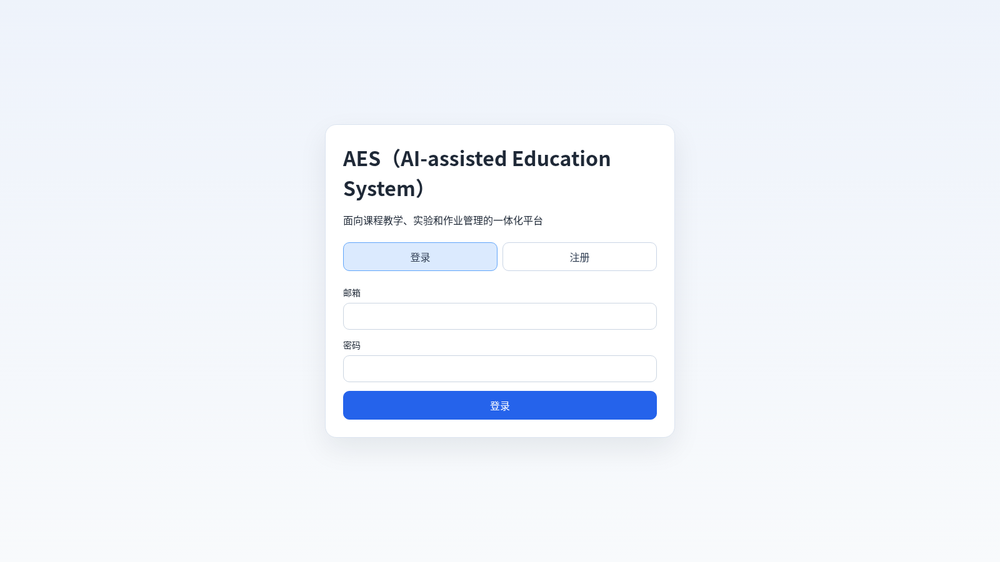

> 公开仓库中的 `superuser.toml` 是可直接编辑的示例配置。部署时必须修改其中的账号和密码；准备向公共仓库提交时，必须先恢复示例值，避免公开真实凭据。

## 功能权限概览

| 功能 | 超级用户 | 教师 | 学生 |
| --- | --- | --- | --- |
| 账户与邀请码 | 配置超级用户；创建教师邀请码；管理用户 | 使用教师邀请码注册；向学生分发班级邀请码 | 使用班级邀请码注册或加入其他班级 |
| 班级 | 查看和管理全站数据 | 创建、编辑、切换和删除自己的班级；管理成员 | 加入、查看和切换自己的班级 |
| AI Provider | 默认不配置教学 Profile | 维护个人 Profile，并推荐或强制班级使用其中一个 Profile | 使用班级 Profile 引用，或维护自己的私有 Profile |
| Slideshow | 默认不参与教学流程 | 上传、查看和删除自己班级的课件 | 浏览当前班级课件并向 AI 提问 |
| Homeworks | 默认不参与教学流程 | 维护题库、发布、撤回、删除、批改和导出作业 | 作答、提交、查看成绩和教师批注 |
| Courseworks | 检查工作区和 Agent Run 状态 | 使用通用 Coding Agent；以只读方式审阅学生工作区 | 用自然语言提出实验任务，在当前课程的独立工作区中开发、构建和测试 |

## 超级用户使用方法

### 1. 配置和登录

交互式安装检测到示例值时会询问新的超级用户凭据。非交互部署应预先编辑根目录的 `superuser.toml`，其格式如下：

```toml
# AES 超级用户登录凭据。部署前必须修改；不要提交真实邮箱和密码。
[superuser]
email = "admin@example.edu"
password = "change-me"

[limits.workspace]
disk_mb = 250
max_terminals = 5
idle_minutes = 30

[limits.execution]
max_cpu_cores = 1.0
max_memory_mb = 1024
max_processes = 192
max_concurrent_qemu = 2

[limits.ai]
max_concurrent_requests_per_user = 1
```

超级用户、教师和学生采用相同的密码长度规则：不少于 6 个字符。系统不额外要求必须包含大小写字母、数字或特殊符号。

`superuser.toml` 是超级用户凭据和全局资源上限的权威来源。Courseworks 后端启动时会读取该文件，把密码的 bcrypt 哈希同步到数据库，并确保配置的账号拥有超级用户身份。修改凭据或资源限制后必须按 [INSTALL.md](INSTALL.md) 的说明重启相关服务；不要直接修改数据库中的超级用户密码。

超级用户使用该邮箱和密码直接登录，不使用邀请码，也不经过注册页面。

### 2. 创建教师邀请码

1. 登录后进入“系统管理”或超级管理员控制台。
2. 打开“邀请码”页面，创建一个教师邀请码，并填写便于识别的说明。
3. 将邀请码通过可信渠道交给对应教师。
4. 每个教师邀请码只能成功注册一名教师；教师注册完成后，应在控制台确认邀请码使用状态和教师账号。
5. 对尚未使用且不再需要的邀请码，应及时停用或删除。

超级用户只负责发放**教师邀请码**。学生使用的班级邀请码由教师创建班级后取得，不应由超级用户代替教师长期维护。

### 3. 管理系统

超级管理员控制台提供以下能力：

- 查看用户、邀请码和工作区数量；
- 查看、启用、禁用或调整用户账号；
- 管理教师邀请码；
- 检查 Courseworks 工作区和 Agent Run；
- 返回服务门户检查系统入口。

删除用户、邀请码或工作区可能影响三个教学模块。执行高影响操作前应确认目标账号和班级，并完成数据库、上传文件和学生工作区备份。

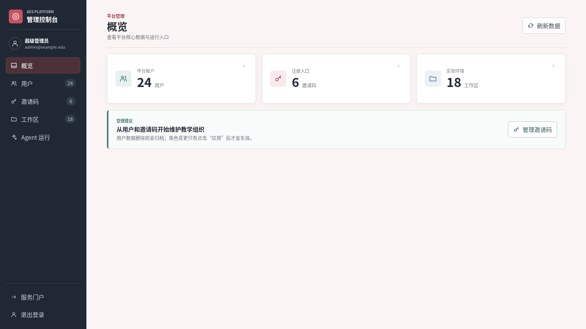

超级用户默认不承担日常教学角色，因此服务门户不会把 Slideshow、Homeworks、Courseworks 当作其主要操作入口。需要授课时，应另外使用教师邀请码注册教师账号。

## 教师使用方法

### 1. 注册教师账号

1. 从超级用户处取得尚未使用的教师邀请码。
2. 在 AES 登录页选择“注册”。
3. 输入教师邀请码，确认系统识别的身份为“教师”。
4. 填写邮箱、姓名、教师工号和密码，完成注册。
5. 登录服务门户后，可在“编辑资料”中修改姓名等资料。

教师邀请码只能使用一次。同一个邮箱不能重复注册教师账号；邀请码无效、已停用或已使用时，应联系超级用户重新分发。

### 2. 创建班级并邀请学生

教师首次登录后需要先建立教学班级：

1. 进入“班级成员管理”，选择“新建班级”。
2. 填写课程名称、班级名称和人数上限。
3. 系统创建班级，并从教师的一级邀请码派生出该班级的二级邀请码。
4. 将班级邀请码发送给学生。学生首次注册或加入其他班级时都使用这个邀请码。
5. 在成员页面查看已加入学生，并可设置或取消助教、移除成员、编辑班级名称和人数上限。

班级邀请码的可用人数受班级容量限制。删除班级或移除成员会影响相关课件、作业和工作区访问，操作前应阅读确认对话框并做好备份。

教师可以建立多个班级。使用“切换班级”选择当前工作班级后，Slideshow、Homeworks 和 Courseworks 都只处理该班级的数据。

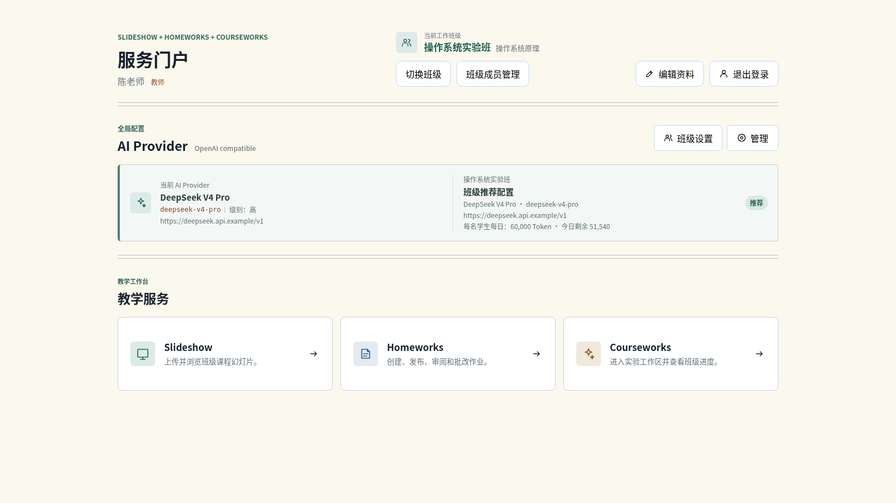

### 3. 配置并为班级指定 AI Provider

教师可以创建多个 OpenAI-compatible Provider Profile，每个 Profile 包含名称、Base URL、API Key、模型和能力级别。建议先使用“测试连接”确认配置有效，再把其中一个 Profile 指派给当前工作班级。

**为班级指定 AI Provider 是教师配置教学 AI 的核心步骤。** 操作流程如下：

1. 在服务门户的 AI Provider 区域维护并测试教师自己的 Profile。
2. 切换到目标班级，点击“班级设置”。
3. 选择要共享给该班级的 Profile。
4. 设置每名学生每日 Token 配额；`0` 表示不限制额度。
5. 选择推荐模式或勾选“强制班级使用此 AI Provider”，然后点击“应用”。

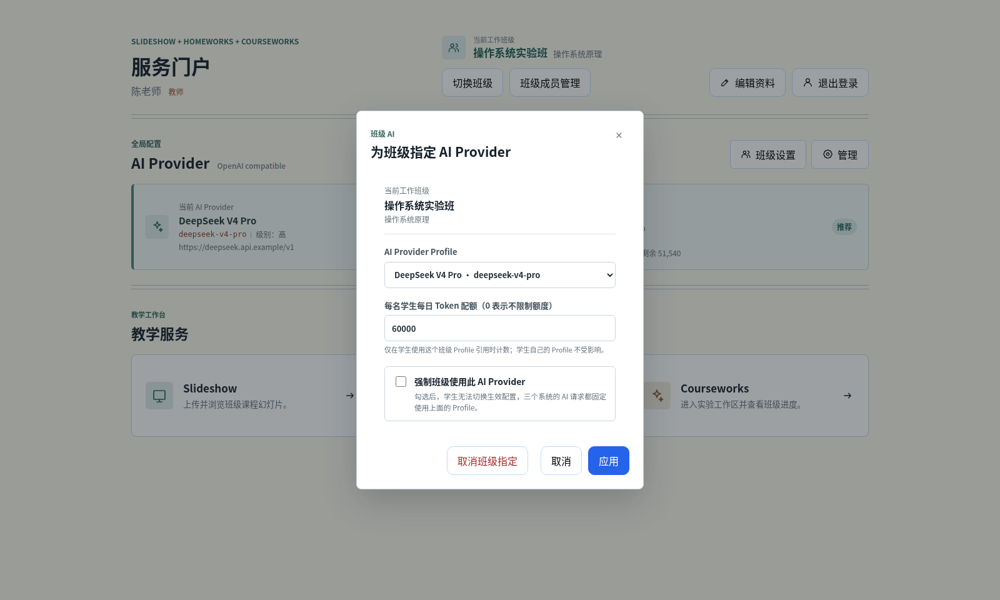

班级配置有两种策略：

- **推荐**：学生默认使用教师指定的 Profile，但仍可改用自己的私有 Profile；
- **强制**：该班级的 AI 请求固定使用教师指定的 Profile，学生不能切换生效配置。

班级配置保存的是对教师 Profile 的**引用**，不是复制品。教师修改原 Profile 后，班级和学生应在刷新页面或发起下一次请求时读取最新内容。API Key 不应通过截图、聊天或公开仓库传播。

指派 Profile 时，教师还可以为该班级设置“每名学生每日 Token 配额”。填写 `0` 表示不限制；设置正整数后，配额仅在学生使用这个班级引用的 Profile 时生效，学生自己的私有 Profile 不受限制。Slideshow、Homeworks 和 Courseworks 共用同一份班级配额，系统按北京时间每天重置，并向学生显示当日已用量和剩余额度。

### 4. Slideshow：管理课件

教师进入 Slideshow 后可以：

1. 确认页面显示的是当前工作班级；
2. 填写课件标题并上传 PPT 或 PPTX；
3. 等待 LibreOffice 和 Poppler 完成转换；
4. 打开转换后的课件检查页面和缩略图；
5. 删除自己上传且不再使用的课件。

课件按班级隔离。大型 PPT 转换需要一定时间，上传后暂未出现时应稍候再刷新，不要连续重复上传。

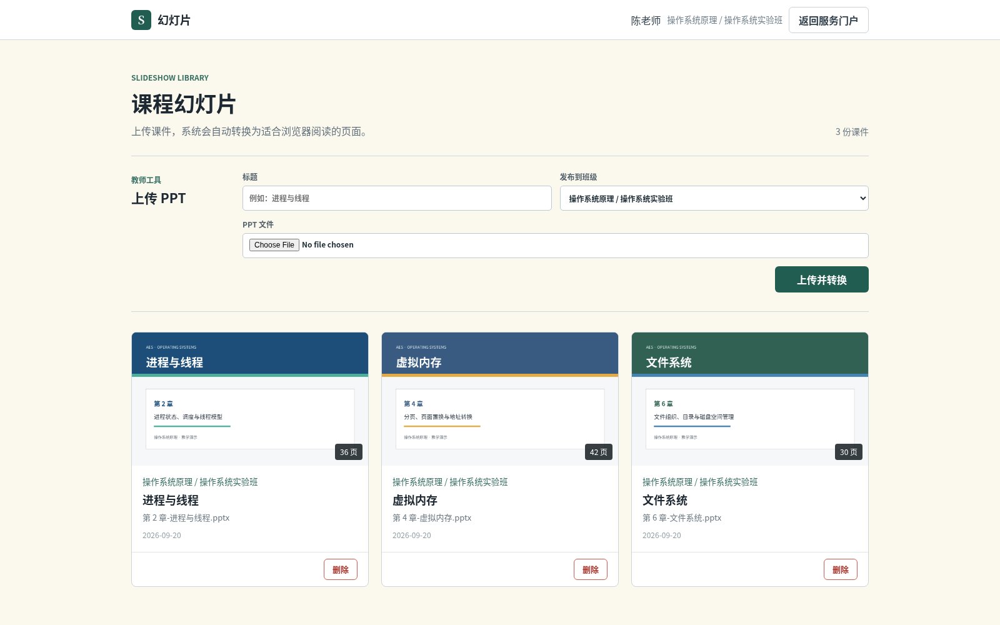

### 5. Homeworks：布置和批改作业

教师的典型工作流程如下：

1. 在“章节与习题”中上传或维护当前课程的题库。
2. 在当前班级创建作业草稿，选择章节、题目和截止时间。
3. 打开草稿检查并编辑，然后发布给学生。
4. 发布后查看学生的未开始、作答中、已提交和已批改状态；未开始的学生不提供批改入口。
5. 对已提交作业填写必需的总分，以及可选的总体评价和逐题批注。
6. 使用“暂存”保存尚未完成的批改，使用“提交”正式向学生发布成绩。
7. 按需开放重交或导出班级成绩。

已发布作业可以撤回为草稿，草稿不能继续批改。删除已经产生学生作答的作业时，系统会提示答案、附件和批改记录也会一并删除，由教师最终确认。

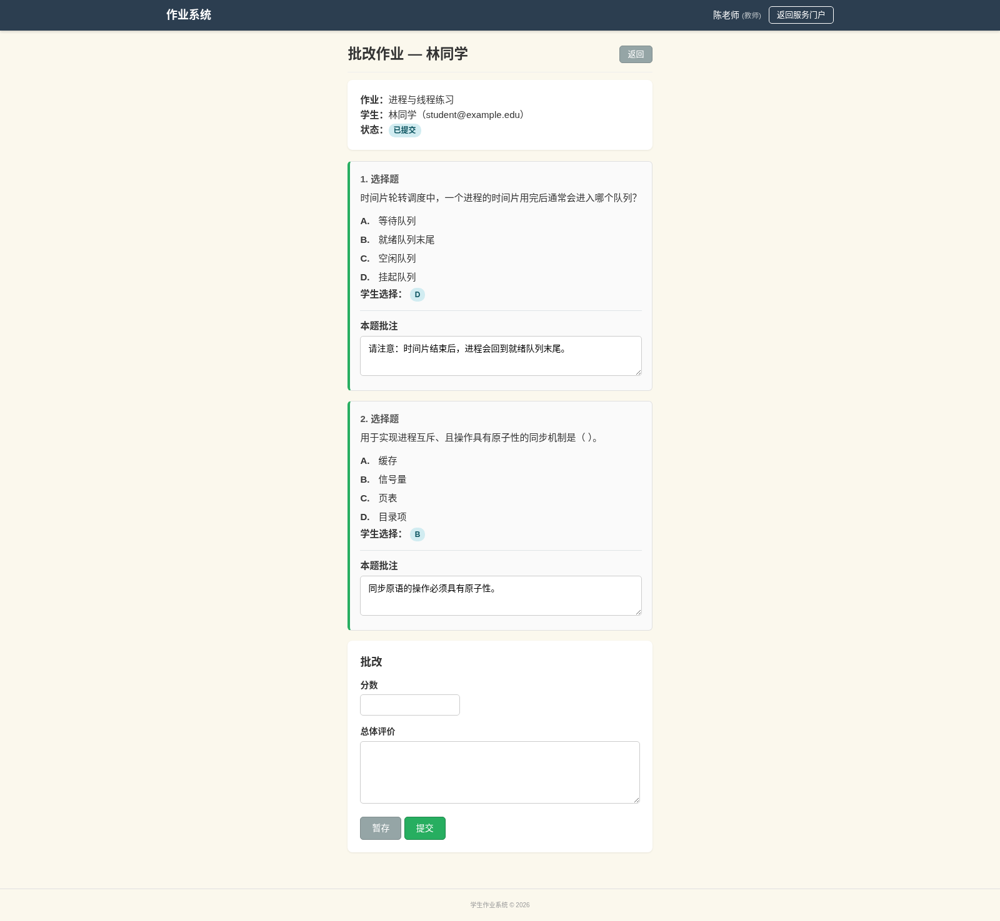

### 6. Courseworks：教师工作区和审阅模式

教师进入 Courseworks 时默认使用自己的课程工作区，可像学生一样编辑文件、运行终端和使用通用 Coding Agent。教师可以直接输入课程实验目标、约束、已有错误或期望结果，让 Agent 围绕工作区中的实际工程规划步骤、修改代码、调用课程工具并验证结果。

切换到“审阅模式”后，教师可以只读查看当前班级已经初始化的学生工作区：

- 浏览学生项目文件，但不能修改学生代码；
- 阅读 `.eva_history` 中保存的 Agent Run 和开发过程；
- 使用审阅 AI 总结单个学生、比较多个学生或汇总全班情况；
- 班级成员或工作区变化后，再次进入审阅模式会按需刷新审阅索引。

审阅目录使用学号区分学生。尚未进入过 Courseworks、因而尚未初始化工作区的学生不会出现在目录中。

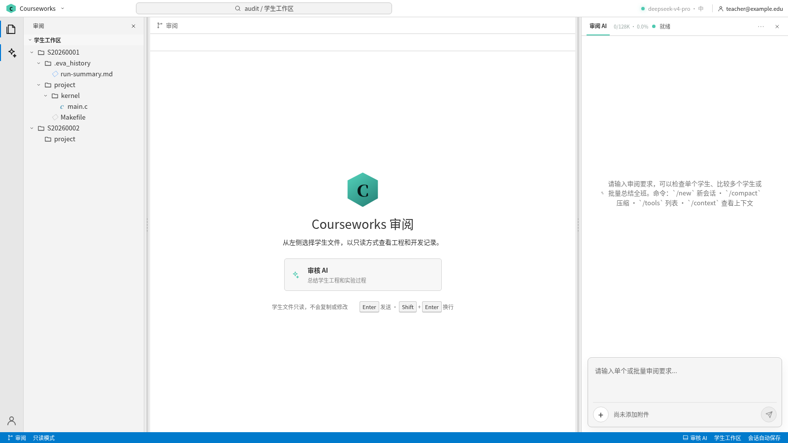

## 学生使用方法

### 1. 注册、加入和切换班级

学生首次使用 AES 时：

1. 从任课教师处取得班级邀请码。
2. 在登录页选择“注册”。
3. 输入班级邀请码，确认课程和班级信息正确。
4. 填写邮箱、姓名、学号和密码，完成学生账号注册。
5. 登录后检查门户顶部的“当前工作班级”。

学生加入另一门课程时不需要重新创建一套登录凭据。在服务门户选择“切换班级”并输入另一位教师提供的班级邀请码，即可加入并切换到新班级。

同一邮箱在不同班级下的数据彼此隔离。切换当前班级会同时改变：

- Slideshow 中可见的课件；
- Homeworks 中的作业和成绩；
- Courseworks 中的代码、实验历史和 AI 会话。

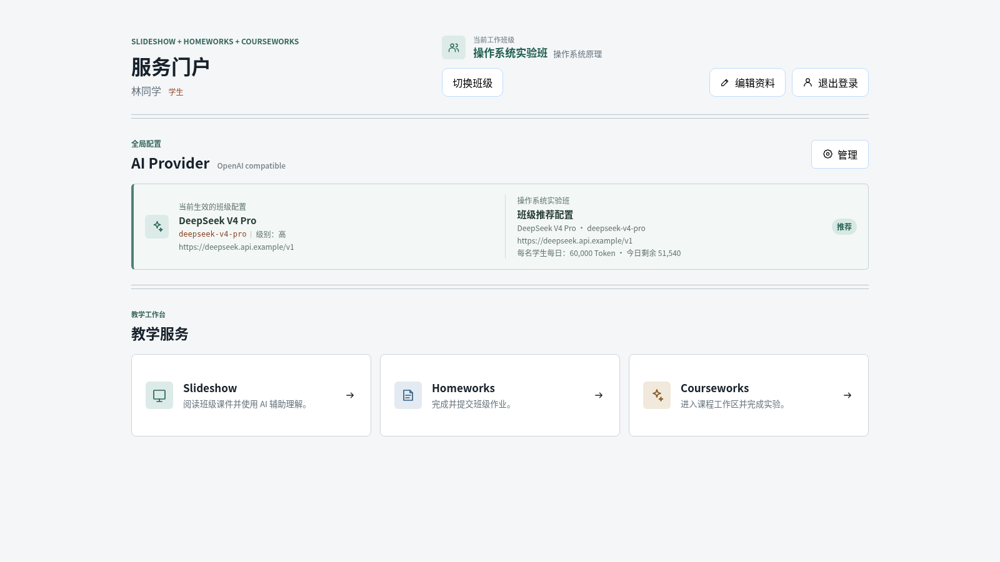

### 2. 选择 AI Provider

学生可能同时看到两类 Profile：

- **班级指派配置**：对教师 Profile 的只读引用。学生可以选用，但不能编辑或删除；教师修改后会自动读取最新内容。
- **个人配置**：由学生自行创建和维护，可以编辑、删除并设为当前配置。

若教师将班级配置设为“推荐”，学生可以在班级配置和个人配置之间选择；若设为“强制”，当前班级必须使用教师指定的配置。实际生效项以门户顶部“当前 AI Provider”为准。

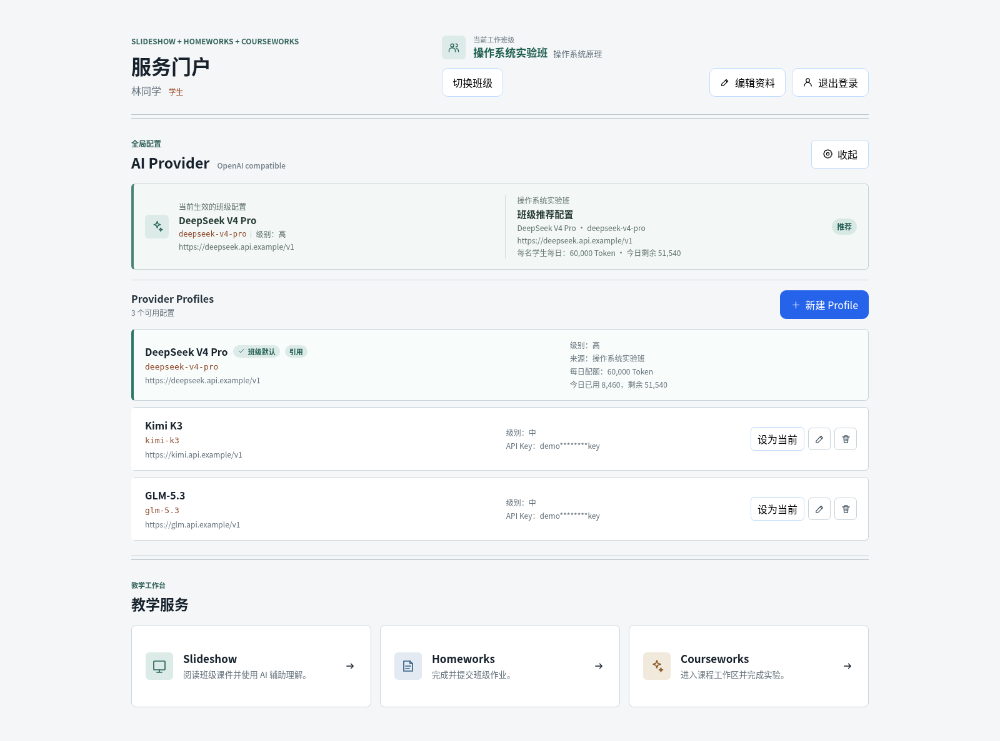

### 3. Slideshow：阅读课件

1. 在服务门户确认当前班级，然后进入 Slideshow。
2. 从课件列表选择教师发布的演示文稿。
3. 使用缩略图或翻页控件浏览课件。
4. 在 AI 问答区围绕课件内容提问。

学生只能查看当前班级的课件，不能上传或删除教师课件。

### 4. Homeworks：完成作业和查看批改

1. 进入 Homeworks，在“待完成”区域打开教师已发布的作业。
2. 填写选择题、填空题或综合题答案，并按要求上传附件。
3. 作答过程中保存内容；确认无误后正式提交。
4. 教师开放重交后，可以修改并再次提交。
5. 已提交和已批改作业会保留在作业记录中；批改完成后可查看总分、总体评价和每道题的教师批注。

作业提交前，“问 AI”只提供概念解释、提示和分步引导，不会直接给出可提交的答案。教师正式批改后，AI 会切换到复盘模式，可以讨论正确答案、学生答案、教师批注和完整解题过程。

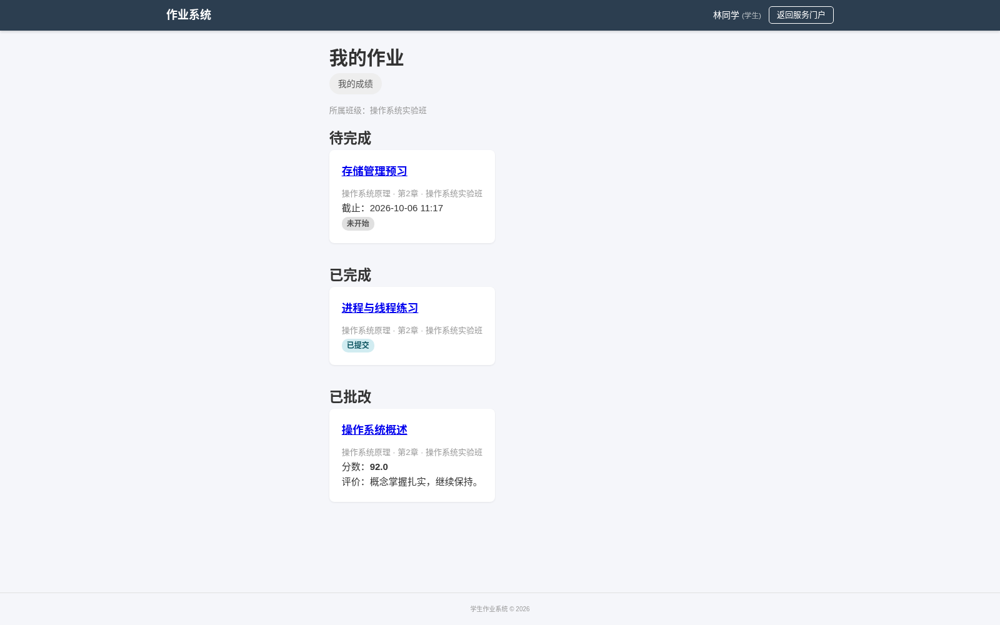

### 5. Courseworks：完成课程实验

Courseworks 的核心不是固定题型或只会回答操作系统问题的问答机器人，而是一个**通用 Coding Agent**。学生可以输入任意自然语言实验任务，例如描述要实现的功能、粘贴报错、要求分析已有工程，或让 Agent 运行测试并继续修复。Agent 会结合当前课程工作区的文件和工具完成开发过程。

1. 从服务门户进入 Courseworks；该模块会在新标签页中打开。
2. 首次进入时等待系统初始化当前课程的独立工作区。
3. 使用左侧资源管理器管理文件，在中央编辑器中编写代码，通过终端构建、测试和调试。
4. 在右侧直接输入课程实验要求，使用 Courseworks Agent 规划任务、创建或修改工程、执行命令、运行测试并分析错误。
5. 需要重新开始任务时创建新会话；Agent Run 和开发记录保存在 `.eva_history` 中。

每名学生在每个班级都有独立的持久化工作区和当前会话。切换班级后不会继续使用上一门课程的文件或 AI 上下文。

Coding Agent 的工作区、终端、文件操作、工具调用和持久化会话是课程无关的，可用于程序设计、数据结构、编译原理、计算机网络等需要编码或实验环境的课程。当前仓库已经完成产品化适配和实际验证的是操作系统课程；接入其他课程时，还需要为该课程准备对应的工具链、运行环境、任务上下文和评价方式，详见 [known-limitations.md](known-limitations.md)。

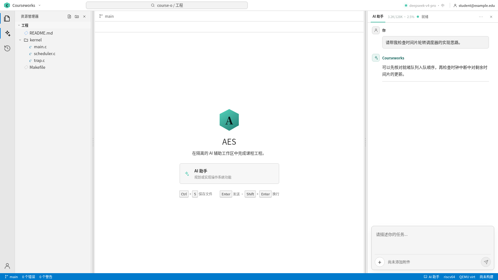

进行操作系统或图形实验时，打开 OS Lab：

- 左侧 Bash 终端用于编译并启动 QEMU；
- 右侧 noVNC 区域显示 QEMU 图形输出；
- 页面离开后重新进入，可按系统保留状态恢复连接。

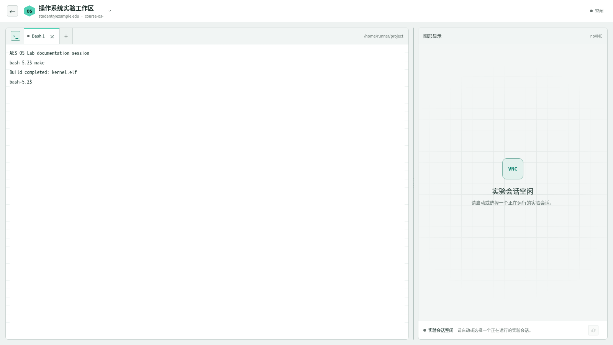

不要在工作区保存个人密码或与课程无关的敏感数据。容器受到 CPU、内存、进程数、磁盘和网络策略限制；任务被终止时应先检查资源使用情况。

## 系统组成

```text
浏览器
  |
  v
Nginx 统一入口
  |-- 服务门户 / Courseworks  --> Node.js + React + MySQL
  |-- Homeworks                --> Flask + SQLite
  `-- Slideshow                --> Flask + SQLite + LibreOffice/Poppler
                                  |
                                  `-- 统一账户、班级和 AI Provider 配置

Courseworks --> Docker 隔离工作区 --> Bash / 编译工具链 / QEMU / noVNC
```

仓库主要目录如下：

| 目录 | 用途 |
| --- | --- |
| `courseworks/` | 服务门户、统一认证、AI Provider 管理、开发工作区和超级管理员控制台 |
| `homeworks/` | 作业、题库、提交、批改、成绩及逐题批注 |
| `slideshow/` | PPT 上传、转换、浏览和课件问答 |
| `management/` | 跨子系统共享的账户、班级、邀请码和归档能力 |
| `accounts-data/` | Homeworks、Slideshow 使用的共享 SQLite 数据 |
| `archive-data/` | 删除账户、班级等操作产生的可恢复归档 |
| `docs/` | 集中的运维说明、系统截图和手工测试场景 |

数据目录、课件转换、Courseworks 容器与受限网络的运维细节集中记录在 [docs/operations.md](docs/operations.md)。

## 数据与备份

AES 的完整业务数据不只在一个数据库中。生产备份至少应包含：

- Courseworks MySQL 数据库；
- `accounts-data/`；
- `homeworks/uploads/`；
- `slideshow/uploads/`；
- `courseworks/student-workspace/`；
- `archive-data/`；
- 生产环境使用的 `courseworks/.env`（应加密保存）；
- 根目录的 `superuser.toml`（包含明文凭据，必须加密保存）。

恢复时必须保持这些数据来自同一个备份时间点。仅复制代码目录不能恢复账户、邀请码、班级、作业、课件或学生工作区。

## 浏览器建议

建议使用当前版本的 Chrome、Edge 或 Firefox。Courseworks 依赖 WebSocket 提供终端和 noVNC 连接；若页面能打开但终端或图形区无法连接，应请管理员检查反向代理、防火墙和 Docker 服务。

## 截图说明

本文截图统一存放在 [`docs/pictures/`](docs/pictures/) 中，并由文档截图脚本使用隔离的临时数据库和虚构 API 响应生成。图中的姓名、邮箱、学号、邀请码、Provider 地址、API Key、课件和工作区内容全部是合成示例，不来自实际用户或生产数据。文件索引、测试数据约定和重拍方法见 [`docs/pictures/README.md`](docs/pictures/README.md)。

## 许可证

AES 项目自有代码采用 [MIT License](LICENSE) 发布，允许个人、学校和企业免费使用、修改、分发及用于商业用途。仓库中引用或随附的第三方软件、库、字体和其他资源仍分别遵循其原有许可证；MIT License 不会替代这些第三方许可条款。
