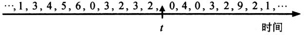
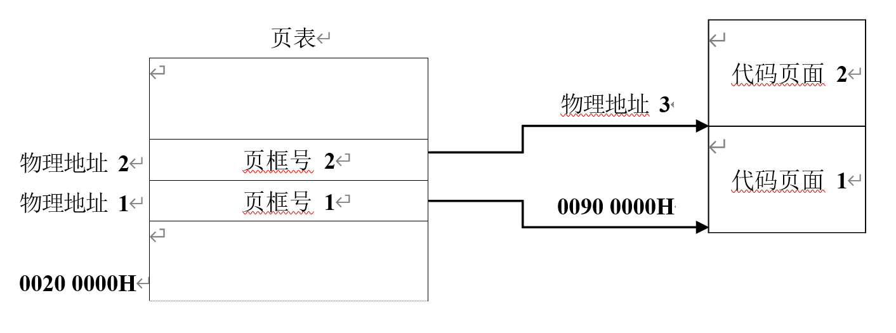

# 按照本书-第3章-主存管理

## 一、选择题

1. (2011) 在虚拟内存管理中，地址变换机构将逻辑地址变换为物理地址，形成该逻辑地址的阶段是（    ）。

A. 编辑
B. 编译
C. 链接
D. 装载

2. (2023) 对于采用虚拟内存管理方式的系统，下列关于进程虚拟地址空间的叙述中，错误的是（    ）。

A. 每个进程都有自己独立的虚拟地址空间
B. C 语言中 malloc() 函数返回的是虚拟地址
C. 进程对数据段和代码段可以有不同的访问权限
D. 虚拟地址空间的大小由内存和硬盘的大小决定

3. (2009) 分区分配内存管理方式的主要保护措施是（    ）。

A. 界地址保护
B. 程序代码保护
C. 数据保护
D. 栈保护

4. (2010) 某基于动态分区存储管理的计算机，其主存容量为 55MB（初始为空闲），采用最佳适配（Best Fit）算法，分配和释放的顺序为：分配 15MB，分配 30MB，释放 15MB，分配 8MB，分配 6MB，此时主存中最大空闲分区的大小是（    ）。

A. 7MB
B. 9MB
C. 10MB
D. 15MB

5. (2017) 某计算机按字节编址，其动态分区内存管理采用最佳适应算法，每次分配和回收内存后都对空闲分区链重新排序。当前空闲分区信息如下表所示。回收起始地址为 60KB、大小为 140KB 的分区后，系统中空闲分区的数量、空闲分区链第一个分区的起始地址和大小分别是（    ）。

| 分区起始地址 | 20KB | 500KB | 1000KB | 200KB |
| --- | ---: | ---: | ---: | ---: |
| 分区大小 | 40KB | 80KB | 100KB | 200KB |

A. 3、20KB、380KB
B. 3、500KB、80KB
C. 4、20KB、180KB
D. 4、500KB、80KB

6. (2019) 在下列动态分区分配算法中，最容易产生内存碎片的是（    ）。

A. 首次适应算法
B. 最坏适应算法
C. 最佳适应算法
D. 循环首次适应算法

7. (2023) 某系统采用页式存储管理，用位图管理空闲页框。若页大小为 4KB，物理内存大小为 16GB，则位图所占空间的大小是（    ）。

A. 128B
B. 128KB
C. 512KB
D. 4MB

8. (2023) 进程 R 和 S 共享数据 data。若 data 在 R 和 S 中所在页的页号分别为 p1 和 p2，两个页所对应的页框号分别为 f1 和 f2，则下列叙述中，正确的是（    ）。

A. p1 和 p2 一定相等，f1 和 f2 一定相等
B. p1 和 p2 一定相等，f1 和 f2 不一定相等
C. p1 和 p2 不一定相等，f1 和 f2 一定相等
D. p1 和 p2 不一定相等，f1 和 f2 不一定相等

9. (2010) 某计算机采用二级页表的分页存储管理方式，按字节编址，页大小为 210B，页表项大小为 2B，逻辑地址结构为：

| 页目录号 | 页号 | 页内偏移量 |
| --- | --- | --- |

逻辑地址空间大小为 216 页，则表示整个逻辑地址空间的页目录表中包含表项的个数至少是（    ）。

A. 64
B. 128
C. 256
D. 512

10. (2014) 下列选项中，属于多级页表优点的是（    ）。

A. 加快地址变换速度
B. 减少缺页中断次数
C. 减少页表项所占字节数
D. 减少页表所占的连续内存空间

11. (2019) 某计算机主存按字节编址，采用二级分页存储管理，地址结构如下所示：

| 页目录号 | 页号 | 页内偏移 |
| --- | --- | --- |
| 10 位 | 10 位 | 12 位 |

虚拟地址 20501225H 对应的页目录号、页号分别是（    ）。

A. 081H、101H
B. 081H、401H
C. 201H、101H
D. 201H、401H

12. (2021) 在采用二级页表的分页系统中，CPU 页表基址寄存器中的内容是（    ）。

A. 当前进程的一级页表的起始虚拟地址
B. 当前进程的一级页表的起始物理地址
C. 当前进程的二级页表的起始虚拟地址
D. 当前进程的二级页表的起始物理地址

13. (2014) 下列措施中，能加快虚实地址转换的是（    ）。

Ⅰ. 增大快表（TLB）容量
Ⅱ. 让页表常驻内存
Ⅲ. 增大交换区（swap）

A. 仅Ⅰ
B. 仅Ⅱ
C. 仅Ⅰ、Ⅱ
D. 仅Ⅱ、Ⅲ

14. (2011) 在缺页处理过程中，操作系统执行的操作可能是（    ）。

Ⅰ. 修改页表
Ⅱ. 磁盘 I/O
Ⅲ. 分配页框

A. 仅Ⅰ、Ⅱ
B. 仅Ⅱ
C. 仅Ⅲ
D. Ⅰ、Ⅱ和Ⅲ

15. (2013) 若用户进程访问内存时产生缺页，则下列选项中，操作系统可能执行的操作是（    ）。

Ⅰ. 处理越界错
Ⅱ. 置换页
Ⅲ. 分配内存

A. 仅Ⅰ、Ⅱ
B. 仅Ⅱ、Ⅲ
C. 仅Ⅰ、Ⅲ
D. Ⅰ、Ⅱ和Ⅲ

16. (2014) 在页式虚拟存储管理系统中，采用某些页面置换算法，会出现 Belady 异常现象，即进程的缺页次数会随着分配给该进程的页框个数的增加而增加。下列算法中，可能出现 Belady 异常现象的是（    ）。

Ⅰ. LRU 算法
Ⅱ. FIFO 算法
Ⅲ. OPT 算法

A. 仅Ⅱ
B. 仅Ⅰ、Ⅱ
C. 仅Ⅰ、Ⅲ
D. 仅Ⅱ、Ⅲ

17. (2015) 在请求分页系统中，页面分配策略与页面置换策略不能组合使用的是（    ）。

A. 可变分配，全局置换
B. 可变分配，局部置换
C. 固定分配，全局置换
D. 固定分配，局部置换

18. (2020) 下列因素中，影响请求分页系统有效（平均）访存时间的是（    ）。

Ⅰ. 缺页率
Ⅱ. 磁盘读写时间
Ⅲ. 内存访问时间
Ⅳ. 执行缺页处理程序的 CPU 时间

A. 仅Ⅱ、Ⅲ
B. 仅Ⅰ、Ⅳ
C. 仅Ⅰ、Ⅲ、Ⅳ
D. Ⅰ、Ⅱ、Ⅲ和Ⅳ

19. (2021) 某请求分页存储系统的页大小为 4KB，按字节编址。系统给进程 P 分配 2 个固定的页框，并采用改进型 Clock 置换算法。进程 P 页表的部分内容如下表所示。

| 页号 | 页框号 | 存在位（1：存在，0：不存在） | 访问位（1：访问，0：未访问） | 修改位（1：修改，0：未修改） |
| --- | --- | --- | --- | --- |
| 2 | 20H | 0 | 0 | 0 |
| 3 | 60H | 1 | 1 | 0 |
| 4 | 80H | 1 | 1 | 1 |

若 P 访问虚拟地址为 02A01H 的存储单元，则经地址变换后得到的物理地址是（    ）。

A. 00A01H
B. 20A01H
C. 60A01H
D. 80A01H

20. (2022) 某进程访问的页 b 不在内存中，导致产生缺页异常。该缺页异常处理过程中不一定包含的操作是（    ）。

A. 淘汰内存中的页
B. 建立页号与页框号的对应关系
C. 将页 b 从外存读入内存
D. 修改页表中页 b 对应的存在位

21. (2022) 下列选项中，不会影响系统缺页率的是（    ）。

A. 页置换算法
B. 工作集的大小
C. 进程的数量
D. 页缓冲队列的长度

22. (2015) 系统为某进程分配了 4 个页框，该进程已访问的页号序列为 2，0，2，9，3，4，2，8，2，4，8，4，5。若进程要访问的下一页的页号为 7，依据 LRU 算法，应淘汰页的页号是（    ）。

A. 2
B. 3
C. 4
D. 8

23. (2016) 某系统采用改进型 CLOCK 置换算法，页表项中字段 A 为访问位，M 为修改位。A=0 表示页最近没有被访问，A=1 表示页最近被访问过。M=0 表示页没有被修改过，M=1 表示页被修改过。按（A，M）所有可能的取值，将页分为四类：（0，0）、（1，0）、（0，1）和（1，1），则该算法淘汰页的次序为（    ）。

A. （0，0），（0，1），（1，0），（1，1）
B. （0，0），（1，0），（0，1），（1，1）
C. （0，0），（0，1），（1，1），（1，0）
D. （0，0），（1，1），（0，1），（1，0）

24. (2019) 某系统采用 LRU 页置换算法和局部置换策略，若系统为进程 P 预分配了 4 个页框，进程 P 访问页号的序列为 0、1、2、7、0、5、3、5、0、2、7、6，则进程访问上述页的过程中，产生页置换的总次数是（    ）。

A. 3
B. 4
C. 5
D. 6

25. (2011) 当系统发生抖动（thrashing）时，可以采取的有效措施是（    ）。

Ⅰ. 撤销部分进程
Ⅱ. 增加磁盘交换区的容量
Ⅲ. 提高用户进程的优先级

A. 仅Ⅰ
B. 仅Ⅱ
C. 仅Ⅲ
D. 仅Ⅰ、Ⅱ

26. (2016) 某进程访问页面的序列如下所示。

若工作集的窗口大小为 6，则在 t 时刻的工作集为（    ）。

A. {6，0，3，2}
B. {2，3，0，4}
C. {0，4，3，2，9}
D. {4，5，6，0，3，2}

27. (2009) 一个分段存储管理系统中，地址长度为 32 位，其中段号占 8 位，则最大段长是（    ）。

A. 28B
B. 216B
C. 224B
D. 232B

28. (2016) 某进程的段表内容如下所示。

| 段号 | 段长 | 内存起始地址 | 权限 | 状态 |
| ---: | ---: | ---: | --- | --- |
| 0 | 100 | 6000 | 只读 | 在内存 |
| 1 | 200 | — | 读写 | 不在内存 |
| 2 | 300 | 4000 | 读写 | 在内存 |

当访问段号为 2、段内地址为 400 的逻辑地址时，进行地址转换的结果是（    ）。

A. 段缺失异常
B. 得到内存地址 4400
C. 越权异常
D. 越界异常

29. (2019) 在分段存储管理系统中，用共享段表描述所有被共享的段。若进程 P1 和 P2 共享段 S，下列叙述中，错误的是（    ）。

A. 在物理内存中仅保存一份段 S 的内容
B. 段 S 在 P1 和 P2 中应该具有相同的段号
C. P1 和 P2 共享段 S 在共享段表中的段表项
D. P1 和 P2 都不再使用段 S 时才回收段 S 所占的内存空间

30. (2012) 下列关于虚拟存储器的叙述中，正确的是（    ）。

A. 虚拟存储只能基于连续分配技术
B. 虚拟存储只能基于非连续分配技术
C. 虚拟存储容量只受外存容量的限制
D. 虚拟存储容量只受内存容量的限制

## 二、综合题

1. (2013) 某计算机主存按字节编址，逻辑地址和物理地址都是 32 位，页表项大小为 4 字节。请回答下列问题。

（1）若使用一级页表的分页存储管理方式，逻辑地址结构如下图所示，则页的大小是多少字节？页表最大占用多少字节？

（2）若使用二级页表的分页存储管理方式，逻辑地址结构如下图所示。设逻辑地址为 LA，请分别给出其对应的页目录号和页表索引的表达式。

（3）采用（1）中的分页存储管理方式，一个代码段起始逻辑地址为 0000 8000H，其长度为 8KB，被装载到从物理地址 0090 0000H 开始的连续主存空间中。页表从主存 0020 0000H 开始的物理地址处连续存放，如下图所示（地址大小自下向上递增）。请计算出该代码段对应的两个页表项的物理地址、这两个页表项中的页框号以及代码页面 2 的起始物理地址。

2. (2015) 某计算机系统按字节编址，采用二级页表的分页存储管理方式，虚拟地址格式如下所示：

| 10 位 | 10 位 | 12 位 |
| --- | --- | --- |
| 页目录号 | 页表索引 | 页内偏移量 |

请回答下列问题。

（1）页和页框的大小各为多少字节？进程的虚拟地址空间大小为多少页？

（2）假定页目录项和页表项均占 4 个字节，则进程的页目录和页表共占多少页？要求写出计算过程。

（3）若某指令周期内访问的虚拟地址为 0100 0000H 和 0111 2048H，则进行地址转换时共访问多少个二级页表？要求说明理由。

3. (2017) 假定题 44 给出的计算机 M 采用二级分页虚拟存储管理方式，虚拟地址格式如下：

| 页目录号（10 位） | 页表索引（10 位） | 页内偏移量（12 位） |
| --- | --- | --- |

请针对题 43 的函数 f1 和题 44 中的机器指令代码，回答下列问题。

（1）函数 f1 的机器指令代码占多少页？

（2）取第 1 条指令（push ebp）时，若在进行地址变换的过程中需要访问内存中的页目录和页表，则会分别访问它们各自的第几个表项（编号从 0 开始）？

（3）M 的 I/O 采用中断控制方式。若进程 P 在调用 f1 之前通过 scanf() 获取 n 的值，则在执行 scanf() 的过程中，进程 P 的状态会如何变化？CPU 是否会进入内核态？

4. (2020) 某 32 位系统采用基于二级页表的请求分页存储管理方式，按字节编址，页目录项和页表项长度均为 4 字节，虚拟地址结构如下所示。

| 页目录号（10 位） | 页号（10 位） | 页内偏移量（12 位） |
| --- | --- | --- |

某 C 程序中数组 a[1024][1024] 的起始虚拟地址为 10800000H，数组元素占 4 字节。该程序运行时，其进程的页目录起始物理地址为 00201000H。请回答下列问题：

（1）数组元素 a[1][2] 的虚拟地址是什么？对应的页目录号和页号分别是什么？对应的页目录项的物理地址是什么？若该目录项中存放的页框号为 00301H，则 a[1][2] 所在页对应的页表项的物理地址是什么？

（2）数组 a 在虚拟地址空间中所占区域是否必须连续？在物理地址空间中所占区域是否必须连续？

（3）已知数组 a 按行优先方式存放，若对数组 a 分别按行遍历和按列遍历，则哪一种遍历方式的局部性更好？

5. (2009) 请求分页管理系统中，假设某进程的页表内容见表 A-2。

表 A-2

| 页号 | 页框（Page Frame）号 | 有效位（存在位） |
| --- | --- | --- |
| 0 | 101H | 1 |
| 1 |  | 0 |
| 2 | 254H | 1 |

页面大小为 4KB，一次内存的访问时间为 100ns，一次快表（TLB）的访问时间为 10ns，处理一次缺页的平均时间为 108ns（已含更新 TLB 和页表的时间），进程的驻留集大小固定为 2，采用最近最少使用置换算法（LRU）和局部淘汰策略。假设①TLB 初始为空；②地址转换时先访问 TLB，若 TLB 未命中，再访问页表（忽略访问页表之后的 TLB 更新时间）；③有效位为 0 表示页面不在内存，产生缺页中断，缺页中断处理后，返回到产生缺页中断的指令处重新执行。设有虚地址访问序列 2362H、1565H、25A5H，请问：

（1）依次访问上述三个虚地址，各需多少时间？给出计算过程。

（2）基于上述访问序列，虚地址 1565H 的物理地址是多少？请说明理由。

6. (2012) 某请求分页系统的局部页面置换策略如下：

系统从 0 时刻开始扫描，每隔 5 个时间单位扫描一轮驻留集（扫描时间忽略不计），本轮没有被访问过的页框将被系统回收，并放入到空闲页框链尾，其中内容在下一次分配之前不被清空。当发生缺页时，如果该页曾被使用过且还在空闲页链表中，则重新放回进程的驻留集中；否则，从空闲页框链表头部取出一个页框。

假设不考虑其它进程的影响和系统开销。初始时进程驻留集为空。目前系统空闲页框链表中页框号依次为 32、15、21、41。进程 P 依次访问的 <虚拟页号，访问时刻> 是：<1,1>、<3,2>、<0,4>、<0,6>、<1,11>、<0,13>、<2,14>。请回答下列问题。

（1）访问 <0,4> 时，对应的页框号是什么？

（2）访问 <1,11> 时，对应的页框号是什么？说明理由。

（3）访问 <2,14> 时，对应的页框号是什么？说明理由。

（4）该策略是否适合于时间局部性好的程序？说明理由。

7. (2010) 设某计算机的逻辑地址空间和物理地址空间均为 64KB，按字节编址。若某进程最多需要 6 页（Page）数据存储空间，页的大小为 1KB，操作系统采用固定分配局部置换策略为此进程分配 4 个页框（Page Frame）。在时刻 260 前的该进程访问情况见表 B-2（访问位即使用位）。

表 B-2

| 页号 | 页框号 | 装入时刻 | 访问位 |
| ---: | ---: | ---: | ---: |
| 0 | 7 | 130 | 1 |
| 1 | 4 | 230 | 1 |
| 2 | 2 | 200 | 1 |
| 3 | 9 | 160 | 1 |

当该进程执行到时刻 260 时，要访问逻辑地址为 17CAH 的数据。请回答下列问题：

（1）该逻辑地址对应的页号是多少？

（2）若采用先进先出（FIFO）置换算法，该逻辑地址对应的物理地址是多少？要求给出计算过程。

（3）若采用时钟（CLOCK）置换算法，该逻辑地址对应的物理地址是多少？要求给出计算过程（设搜索下一页的指针沿顺时针方向移动，且当前指向 2 号页框，示意图如图 B-6 所示）。

