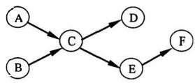

# 按照本书-第5章-进程同步与死锁

## 一、选择题

1. (2010) 设与某资源关联的信号量初值为 3，当前值为 1。若 M 表示该资源的可用个数，N 表示等待该资源的进程数，则 M、N 分别是（    ）。

A. 0、1
B. 1、0
C. 1、2
D. 2、0

2. (2010) 进程 P0 和 P1 的共享变量定义及其初值为：

```c
boolean flag[2];
int turn = 0;
flag[0] = FALSE;
flag[1] = FALSE;
```

若进程 P0 和 P1 访问临界资源的类 C 伪代码实现如下：

```c
void P0() {                 // 进程 P0
    while (TRUE) {
        flag[0] = TRUE;
        turn = 1;
        while (flag[1] && (turn == 1));
        临界区;
        flag[0] = FALSE;
    }
}

void P1() {                 // 进程 P1
    while (TRUE) {
        flag[1] = TRUE;
        turn = 0;
        while (flag[0] && (turn == 0));
        临界区;
        flag[1] = FALSE;
    }
}
```

则并发执行进程 P0 和 P1 时产生的情形是（    ）。

A. 不能保证进程互斥进入临界区，会出现“饥饿”现象
B. 不能保证进程互斥进入临界区，不会出现“饥饿”现象
C. 能保证进程互斥进入临界区，会出现“饥饿”现象
D. 能保证进程互斥进入临界区，不会出现“饥饿”现象

3. (2011) 有两个并发执行的进程 P1 和 P2，共享初值为 1 的变量 x。P1 对 x 加 1，P2 对 x 减 1。加 1 和减 1 操作的指令序列分别如下所示。

| //加 1 操作 |  | //减 1 操作 |
| --- | --- | --- |
| load R1,x<br>inc R1 | //取 x 到寄存器 R1 中 | load R2,x<br>dec R2 |
| store x,R1 | //将 R1 的内容存入 x | store x,R2 |

两个操作完成后，x 的值（    ）。

A. 可能为 -1 或 3
B. 只能为 1
C. 可能为 0、1 或 2
D. 可能为 -1、0、1 或 2

4. (2016) 使用 TSL（Test and Set Lock）指令实现进程互斥的伪代码如下所示。

```c
do {
    ...
    while (TSL(&lock));
    critical section;
    lock = FALSE;
    ...
} while (TRUE);
```

下列与该实现机制相关的叙述中，正确的是（    ）。

A. 退出临界区的进程负责唤醒阻塞态进程
B. 等待进入临界区的进程不会主动放弃 CPU
C. 上述伪代码满足“让权等待”的同步准则
D. while (TSL(&lock)) 语句应在关中断状态下执行

5. (2016) 进程 P1 和 P2 均包含并发执行的线程，部分伪代码描述如下所示。

| 进程 P1 | 进程 P2 |
| --- | --- |
| `int x = 0;`<br>`Thread1()`<br>`{`<br>`    int a;`<br>`    a = 1;`<br>`    x += 1;`<br>`}`<br>`Thread2()`<br>`{`<br>`    int a;`<br>`    a = 2;`<br>`    x += 2;`<br>`}` | `int x = 0;`<br>`Thread3()`<br>`{`<br>`    int a;`<br>`    a = x;`<br>`    x += 3;`<br>`}`<br>`Thread4()`<br>`{`<br>`    int b;`<br>`    b = x;`<br>`    x += 4;`<br>`}` |

下列选项中，需要互斥执行的操作是（    ）。

A. a=1 与 a=2
B. a=x 与 b=x
C. x+=1 与 x+=2
D. x+=1 与 x+=3

6. (2016) 下列关于管程的叙述中，错误的是（    ）。

A. 管程只能用于实现进程的互斥
B. 管程是由编程语言支持的进程同步机制
C. 任何时候只能有一个进程在管程中执行
D. 管程中定义的变量只能被管程内的过程访问

7. (2018) 属于同一进程的两个线程 thread1 和 thread2 并发执行，共享初值为 0 的全局变量 x。thread1 和 thread2 实现对全局变量 x 加 1 的机器级代码描述如下。

| thread1 | thread2 |
| --- | --- |
| `mov R1, x  // (x) -> R1` | `mov R2, x  // (x) -> R2` |
| `inc R1     // (R1)+1 -> R1` | `inc R2     // (R2)+1 -> R2` |
| `mov x, R1  // (R1) -> x` | `mov x, R2  // (R2) -> x` |

在所有可能的指令执行序列中，使 x 的值为 2 的序列个数是（    ）。

A. 1
B. 2
C. 3
D. 4

8. (2018) 若 x 是管程内的条件变量，则当进程执行 x.wait() 时所做的工作是（    ）。

A. 实现对变量 x 的互斥访问
B. 唤醒一个在 x 上阻塞的进程
C. 根据 x 的值判断该进程是否进入阻塞状态
D. 阻塞该进程，并将之插入 x 的阻塞队列中

9. (2018) 在下列同步机制中，可以实现让权等待的是（    ）。

A. Peterson 方法
B. swap 指令
C. 信号量方法
D. TestAndSet 指令

10. (2020) 下列准则中，实现临界区互斥机制必须遵循的是（    ）。

Ⅰ. 两个进程不能同时进入临界区
Ⅱ. 允许进程访问空闲的临界资源
Ⅲ. 进程等待进入临界区的时间是有限的
Ⅳ. 不能进入临界区的执行态进程立即放弃 CPU

A. 仅Ⅰ、Ⅳ
B. 仅Ⅱ、Ⅲ
C. 仅Ⅰ、Ⅱ、Ⅲ
D. 仅Ⅰ、Ⅲ、Ⅳ

11. (2009) 某计算机系统中有 8 台打印机，由 K 个进程竞争使用，每个进程最多需要 3 台打印机。该系统可能会发生死锁的 K 的最小值是（    ）。

A. 2
B. 3
C. 4
D. 5

12. (2011) 某时刻进程的资源使用情况如下表所示。

| 进程 | 已分配 R1 | 已分配 R2 | 已分配 R3 | 尚需 R1 | 尚需 R2 | 尚需 R3 | 可用 R1 | 可用 R2 | 可用 R3 |
| --- | ---: | ---: | ---: | ---: | ---: | ---: | ---: | ---: | ---: |
| P1 | 2 | 0 | 0 | 0 | 0 | 1 | 0 | 2 | 1 |
| P2 | 1 | 2 | 0 | 1 | 3 | 2 | 0 | 2 | 1 |
| P3 | 0 | 1 | 1 | 1 | 3 | 1 | 0 | 2 | 1 |
| P4 | 0 | 0 | 1 | 2 | 0 | 0 | 0 | 2 | 1 |

此时的安全序列是（    ）。

A. P1，P2，P3，P4
B. P1，P3，P2，P4
C. P1，P4，P3，P2
D. 不存在的

13. (2012) 假设 5 个进程 P0、P1、P2、P3、P4 共享三类资源 R1、R2、R3，这些资源总数分别为 18、6、22。T0 时刻的资源分配情况如下表所示，此时存在的一个安全序列是（    ）。

| 进程 | 已分配 R1 | 已分配 R2 | 已分配 R3 | 资源最大需求 R1 | 资源最大需求 R2 | 资源最大需求 R3 |
| --- | ---: | ---: | ---: | ---: | ---: | ---: |
| P0 | 3 | 2 | 3 | 5 | 5 | 10 |
| P1 | 4 | 0 | 3 | 5 | 3 | 6 |
| P2 | 4 | 0 | 5 | 4 | 0 | 11 |
| P3 | 2 | 0 | 4 | 4 | 2 | 5 |
| P4 | 3 | 1 | 4 | 4 | 2 | 4 |

A. P0，P2，P4，P1，P3
B. P1，P0，P3，P4，P2
C. P2，P1，P0，P3，P4
D. P3，P4，P2，P1，P0

14. (2013) 下列关于银行家算法的叙述中，正确的是（    ）。

A. 银行家算法可以预防死锁
B. 当系统处于安全状态时，系统中一定无死锁进程
C. 当系统处于不安全状态时，系统中一定会出现死锁进程
D. 银行家算法破坏了死锁必要条件中的“请求和保持”条件

15. (2014) 某系统有 n 台互斥使用的同类设备，三个并发进程分别需要 3、4、5 台设备，可确保系统不发生死锁的设备数 n 最小为（    ）。

A. 9
B. 10
C. 11
D. 12

16. (2015) 若系统 S1 采用死锁避免方法，S2 采用死锁检测方法。下列叙述中，正确的是（    ）。

Ⅰ. S1 会限制用户申请资源的顺序，而 S2 不会
Ⅱ. S1 需要进程运行所需资源总量信息，而 S2 不需要
Ⅲ. S1 不会给可能导致死锁的进程分配资源，而 S2 会

A. 仅Ⅰ、Ⅱ
B. 仅Ⅱ、Ⅲ
C. 仅Ⅰ、Ⅲ
D. Ⅰ、Ⅱ、Ⅲ

17. (2016) 系统中有 3 个不同的临界资源 R1、R2 和 R3，被 4 个进程 p1、p2、p3 及 p4 共享。各进程对资源的需求为：p1 申请 R1 和 R2，p2 申请 R2 和 R3，p3 申请 R1 和 R3，p4 申请 R2。若系统出现死锁，则处于死锁状态的进程数至少是（    ）。

A. 1
B. 2
C. 3
D. 4

18. (2018) 假设系统中有 4 个同类资源，进程 P1、P2 和 P3 需要的资源数分别为 4、3 和 1，P1、P2 和 P3 已申请到的资源数分别为 2、1 和 0，则执行安全性检测算法的结果是（    ）。

A. 不存在安全序列，系统处于不安全状态
B. 存在多个安全序列，系统处于安全状态
C. 存在唯一安全序列 P3、P1、P2，系统处于安全状态
D. 存在唯一安全序列 P3、P2、P1，系统处于安全状态

19. (2019) 下列关于死锁的叙述中，正确的是（    ）。

Ⅰ. 可以通过剥夺进程资源解除死锁
Ⅱ. 死锁的预防方法能确保系统不发生死锁
Ⅲ. 银行家算法可以判断系统是否处于死锁状态
Ⅳ. 当系统出现死锁时，必然有两个或两个以上的进程处于阻塞态

A. 仅Ⅱ、Ⅲ
B. 仅Ⅰ、Ⅱ、Ⅳ
C. 仅Ⅰ、Ⅱ、Ⅲ
D. 仅Ⅰ、Ⅲ、Ⅳ

20. (2020) 某系统中有 A 类和 B 类资源各 6 个，t 时刻资源分配及需求情况如下表所示。

| 进程 | A 已分配数量 | B 已分配数量 | A 需求总量 | B 需求总量 |
| --- | ---: | ---: | ---: | ---: |
| P1 | 2 | 3 | 4 | 4 |
| P2 | 2 | 1 | 3 | 1 |
| P3 | 1 | 2 | 3 | 4 |

t 时刻安全性检测结果是（    ）。

A. 存在安全序列 P1、P2、P3
B. 存在安全序列 P2、P1、P3
C. 存在安全序列 P2、P3、P1
D. 不存在安全序列

21. (2021) 若系统中有 n（n≥2）个进程，每个进程均需要使用某类临界资源 2 个，则系统不会发生死锁所需的该类资源总数至少是（    ）。

A. 2
B. n
C. n+1
D. 2n

22. (2022) 系统中有三个进程 P0、P1、P2 及 A 类、B 类和 C 类三类资源。若某时刻系统分配资源的情况如下表所示，则此时系统中存在的安全序列的个数为（    ）。

| 进程 | 已分配 A | 已分配 B | 已分配 C | 尚需 A | 尚需 B | 尚需 C | 可用 A | 可用 B | 可用 C |
| --- | ---: | ---: | ---: | ---: | ---: | ---: | ---: | ---: | ---: |
| P0 | 2 | 0 | 1 | 0 | 2 | 1 | 1 | 3 | 2 |
| P1 | 0 | 2 | 0 | 1 | 2 | 3 |  |  |  |
| P2 | 1 | 0 | 1 | 0 | 1 | 3 |  |  |  |

A. 1
B. 2
C. 3
D. 4

## 二、综合题

1. (2009) 三个进程 P1、P2、P3 互斥使用一个包含 N（N>0）个单元的缓冲区。P1 每次用 produce()生成一个正整数并用 put()送入缓冲区某一空单元中；P2 每次用 getodd()从该缓冲区中取出一个奇数并用countodd()统计奇数个数；P3 每次用 geteven()从该缓冲区中取出一个偶数并用 counteven()统计偶数个数。请用信号量机制实现这三个进程的同步与互斥活动，并说明所定义信号量的含义。要求用伪代码描述。

2. (2011) 某银行提供 1 个服务窗口和 10 个供顾客等待的座位。顾客到达银行时，若有空座位，则到取号机上领取一个号，等待叫号。取号机每次仅允许一位顾客使用。当营业员空闲时，通过叫号选取一位顾客，并为其服务。顾客和营业员的活动过程描述如下：

```text
cobegin
{
process 顾客 i
{
    从取号机获取一个号码；
    等待叫号；
    获取服务；
}
process 营业员
{
    while（TRUE）
    {
        叫号；
        为客户服务；
    }
}
}coend
```

请添加必要的信号量和 P、V（或 wait()、signal()）操作，实现上述过程中的互斥与同步。要求写出完整的过程，说明信号量的含义并赋初值。

3. (2013) 某博物馆最多可容纳 500 人同时参观，有一个出入口，该出入口一次仅允许一个人通过。参观者的活动描述如下：

```text
cobegin
参观者进程 i:
{
    ...
    进门;
    ...
    参观;
    ...
    出门;
    ...
}
coend
```

请添加必要的信号量和 P、V（或 wait()、signal()）操作，以实现上述过程中的互斥与同步。要求写出完整的过程，说明信号量的含义并赋初值。

4. (2014) 系统中有多个生产者进程和多个消费者进程，共享一个能存放 1000 件产品的环形缓冲区（初始为空）。当缓冲区未满时，生产者进程可以放入其生产的一件产品，否则等待；当缓冲区未空时，消费者进程可以从缓冲区取走一件产品，否则等待。要求一个消费者进程从缓冲区连续取出 10 件产品后，其他消费者进程才可以取产品。请使用信号量 P、V（wait()、signal()）操作实现进程间的互斥与同步，要求写出完整的过程，并说明所用信号量的含义和初值。

5. (2015) 有 A、B 两人通过信箱进行辩论，每个人都从自己的信箱中取得对方的问题，将答案和向对方提出的新问题组成一个邮件放入对方的信箱中。假设 A 的信箱最多放 M 个邮件，B 的信箱最多放 N 个邮件。初始时 A 的信箱中有 x 个邮件（0<x<M），B 的信箱中有 y 个邮件（0<y<N）。辩论者每取出一个邮件，邮件数减 1。A 和 B 两人的操作过程描述如下：

| A | B |
| --- | --- |
| `while(TRUE){`<br>`    从 A 的信箱中取出一个邮件;`<br>`    回答问题并提出一个新问题;`<br>`    将新邮件放入 B 的信箱;`<br>`}` | `while(TRUE){`<br>`    从 B 的信箱中取出一个邮件;`<br>`    回答问题并提出一个新问题;`<br>`    将新邮件放入 A 的信箱;`<br>`}` |

当信箱不为空时，辩论者才能从信箱中取邮件，否则等待。当信箱不满时，辩论者才能将新邮件放入信箱，否则等待。请添加必要的信号量和 P、V（或 wait、signal）操作，以实现上述过程的同步。要求写出完整的过程，并说明信号量的含义和初值。

6. (2017) 某进程中有 3 个并发执行的线程 thread1、thread2 和 thread3，其伪代码如下所示。

```c
// 复数的结构类型定义
typedef struct {
    float a;
    float b;
} cnum;

cnum x, y, z; // 全局变量

// 计算两个复数之和
cnum add(cnum p, cnum q)
{
    cnum s;
    s.a = p.a + q.a;
    s.b = p.b + q.b;
    return s;
}

thread1
{
    cnum w;
    w = add(x, y);
    ...
}

thread2
{
    cnum w;
    w = add(y, z);
    ...
}

thread3
{
    cnum w;
    w.a = 1;
    w.b = 1;
    z = add(z, w);
    y = add(y, w);
    ...
}
```

请添加必要的信号量和 P、V（或 wait()、signal()）操作，要求确保线程互斥访问临界资源，并且最大程度地并发执行。

7. (2020) 现有 5 个操作 A、B、C、D 和 E。操作 C 必须在 A 和 B 完成后执行，操作 E 必须在 C 和 D 完成后执行。请使用信号量的 wait()、signal() 操作（P、V 操作）描述上述操作之间的同步关系，并说明所用信号量及其初值。

8. (2021) 下表给出了整型信号量 S 的 wait() 和 signal() 操作的功能描述，以及采用开、关中断指令实现信号量操作互斥的两种方法。

| 功能描述 | 方法1 | 方法2 |
| --- | --- | --- |
| `Semaphore S;` | `Semaphore S;` | `Semaphore S;` |
| `wait(S) {` | `wait(S) {` | `wait(S) {` |
| `while (S <= 0);` | 关中断； | 关中断； |
| `S = S - 1;` | `while (S <= 0);` | `while (S <= 0);` |
| `}` | `S = S - 1;` | 开中断； |
|  | 开中断； | 关中断； |
|  | `}` | `S = S - 1;` |
|  |  | 开中断； |
|  |  | `}` |
| `signal(S) {` | `signal(S) {` | `signal(S) {` |
| `S = S + 1;` | 关中断； | 关中断； |
| `}` | `S = S + 1;` | `S = S + 1;` |
|  | 开中断； | 开中断； |
|  | `}` | `}` |

请回答下列问题：

（1）为什么在 wait() 和 signal() 操作中对信号量 S 的访问必须互斥执行？

（2）分别说明方法 1 和方法 2 是否正确。若不正确，请说明理由。

（3）用户程序能否使用开、关中断指令实现临界区互斥？为什么？

9. (2022) 某进程的两个线程 T1 和 T2 并发执行 A、B、C、D、E 和 F 共 6 个操作，其中 T1 执行 A、E 和 F，T2 执行 B、C 和 D。题图表示上述 6 个操作的执行顺序必须满足的约束：C 在 A 和 B 完成后执行，D 和 E 在 C 完成后执行，F 在 E 完成后执行。请使用信号量的 wait()、signal() 操作描述 T1 和 T2 之间的同步关系，并说明所用信号量的作用及其初值。



10. (2023) 现要求学生使用 swap 指令和布尔型变量 lock 实现临界区互斥。lock 为线程间共享的变量；lock 的值为 TRUE 时，线程不能进入临界区；lock 的值为 FALSE 时，线程能进入临界区。某同学编写的实现临界区互斥的伪代码如题 45（a）图所示。

题 45（a）图：某同学编写的伪代码

```text
bool lock = FALSE; // 共享变量
...
bool key = TRUE;
if (key == TRUE)
    swap key, lock; // 交换 key 和 lock 的值
临界区;
lock = TRUE;
...
```

题 45（b）图：newSwap() 的代码

```c
void newSwap(bool *a, bool *b)
{
    bool temp = *a;
    *a = *b;
    *b = temp;
}
```

请回答下列问题：

（1）题 45（a）图的伪代码中哪些语句存在错误？将其改为正确的语句（不增加语句条数）。

（2）题 45（b）图给出了交换两个变量值的函数 newSwap() 的代码，是否可以用函数调用语句 `newSwap(&key, &lock)` 代替指令 `swap key, lock` 以实现临界区互斥？为什么？

11. (2019) 有 n（n≥3）位哲学家围坐在一张圆桌边，每位哲学家交替地就餐和思考。在圆桌中心有 m（m≥1）个碗，每两位哲学家之间有 1 根筷子。每位哲学家必须取到一个碗和两侧的筷子后，才能就餐；进餐完毕，将碗和筷子放回原位，并继续思考。为使尽可能多的哲学家同时就餐，且防止出现死锁现象，请使用信号量的 P、V 操作［wait()、signal() 操作］描述上述过程中的互斥与同步，并说明所用信号量及初值的含义。
