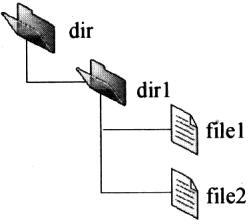
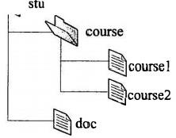

# 按照本书-第6章-文件系统

## 一、选择题

1. (2009) 下列文件物理结构中，适合随机访问且易于文件扩展的是（    ）。

A. 连续结构
B. 索引结构
C. 链式结构且磁盘块定长
D. 链式结构且磁盘块变长

2. (2010) 设文件索引节点中有 7 个地址项，其中 4 个地址项是直接地址索引，2 个地址项是一级间接地址索引，1 个地址项是二级间接地址索引，每个地址项大小为 4B。若磁盘索引块和磁盘数据块大小均为 256B，则可表示的单个文件最大长度是（    ）。

A. 33KB
B. 519KB
C. 1 057KB
D. 16 513KB

3. (2013) 为支持 CD-ROM 中视频文件的快速随机播放，播放性能最好的文件数据块组织方式是（    ）。

A. 连续结构
B. 链式结构
C. 直接索引结构
D. 多级索引结构

4. (2013) 若某文件系统索引结点（inode）中有直接地址项和间接地址项，则下列选项中，与单个文件长度无关的因素是（    ）。

A. 索引结点的总数
B. 间接地址索引的级数
C. 地址项的个数
D. 文件块大小

5. (2015) 在文件的索引节点中存放直接索引指针 10 个，一级和二级索引指针各 1 个。磁盘块大小为 1KB，每个索引指针占 4 个字节。若某文件的索引节点已在内存中，则把该文件偏移量（按字节编址）为 1234 和 307400 处所在的磁盘块读入内存，需访问的磁盘块个数分别是（    ）。

A. 1、2
B. 1、3
C. 2、3
D. 2、4

6. (2020) 下列选项中，支持文件长度可变、随机访问的磁盘存储空间分配方式是（    ）。

A. 索引分配
B. 链接分配
C. 连续分配
D. 动态分区分配

7. (2009) 文件系统中，文件访问控制信息存储的合理位置是（    ）。

A. 文件控制块
B. 文件分配表
C. 用户口令表
D. 系统注册表

8. (2009) 设文件 F1 的当前引用计数值为 1，先建立 F1 的符号链接（软链接）文件 F2，再建立 F1 的硬链接文件 F3，然后删除 F1。此时，F2 和 F3 的引用计数值分别是（    ）。

A. 0、1
B. 1、1
C. 1、2
D. 2、1

9. (2013) 用户在删除某文件的过程中，操作系统不可能执行的操作是（    ）。

A. 删除此文件所在的目录
B. 删除与此文件关联的目录项
C. 删除与此文件对应的文件控制块
D. 释放与此文件关联的内存缓冲区

10. (2014) 在一个文件被用户进程首次打开的过程中，操作系统需做的是（    ）。

A. 将文件内容读到内存中
B. 将文件控制块读到内存中
C. 修改文件控制块中的读写权限
D. 将文件的数据缓冲区首指针返回给用户进程

11. (2017) 某文件系统中，针对每个文件，用户类别分为 4 类：安全管理员、文件主、文件主的伙伴、其他用户；访问权限分为 5 种：完全控制、执行、修改、读取、写入。若文件控制块中用二进制位串表示文件权限，为表示不同类别用户对一个文件的访问权限，则描述文件权限的位数至少应为（    ）。

A. 5
B. 9
C. 12
D. 20

12. (2017) 若文件 f1 的硬链接为 f2，两个进程分别打开 f1 和 f2，获得对应的文件描述符为 fd1 和 fd2，则下列叙述中，正确的是（    ）。

Ⅰ. f1 和 f2 的读写指针位置保持相同
Ⅱ. f1 和 f2 共享同一个内存索引结点
Ⅲ. fd1 和 fd2 分别指向各自的用户打开文件表中的一项

A. 仅Ⅲ
B. 仅Ⅱ、Ⅲ
C. 仅Ⅰ、Ⅱ
D. Ⅰ、Ⅱ和Ⅲ

13. (2020) 若多个进程共享同一个文件 F，则下列叙述中，正确的是（    ）。

A. 各进程只能用“读”方式打开文件 F
B. 在系统打开文件表中仅有一个表项包含 F 的属性
C. 各进程的用户打开文件表中关于 F 的表项内容相同
D. 进程关闭 F 时，系统删除 F 在系统打开文件表中的表项

14. (2021) 若目录 dir 下有文件 file1，则为删除该文件内核不必完成的工作是（    ）。

A. 删除 file1 的快捷方式
B. 释放 file1 的文件控制块
C. 释放 file1 占用的磁盘空间
D. 删除目录 dir 中与 file1 对应的目录项

15. (2023) 若文件 F 仅被进程 P 打开并访问，则当进程 P 关闭 F 时，下列操作中，文件系统需要完成的是（    ）。

A. 删除目录文件中 F 的目录项
B. 释放 F 的索引节点所占的内存空间
C. 释放 F 的索引节点所占的外存空间
D. 将文件磁盘索引结点中的链接计数减 1

16. (2010) 设置当前工作目录的主要目的是（    ）。

A. 节省外存空间
B. 节省内存空间
C. 加快文件的检索速度
D. 加快文件的读/写速度

17. (2017) 下列选项中，磁盘逻辑格式化程序所做的工作是（    ）。

Ⅰ. 对磁盘进行分区
Ⅱ. 建立文件系统的根目录
Ⅲ. 确定磁盘扇区校验码所占位数
Ⅳ. 对保存空闲磁盘块信息的数据结构进行初始化

A. 仅Ⅱ
B. 仅Ⅱ、Ⅳ
C. 仅Ⅲ、Ⅳ
D. 仅Ⅰ、Ⅱ、Ⅳ

18. (2020) 某文件系统的目录项由文件名和索引结点号构成。若每个目录项长度为 64 字节，其中 4 字节存放索引结点号，60 字节存放文件名。文件名由小写英文字母构成，则该文件系统能创建的文件数量的上限为（    ）。

A. 226
B. 232
C. 260
D. 264

19. (2019) 下列选项中，可用于文件系统管理空闲磁盘块的数据结构是（    ）。

Ⅰ. 位图
Ⅱ. 索引结点
Ⅲ. 空闲磁盘块链
Ⅳ. 文件分配表（FAT）

A. 仅Ⅰ、Ⅱ
B. 仅Ⅰ、Ⅲ、Ⅳ
C. 仅Ⅰ、Ⅲ
D. 仅Ⅱ、Ⅲ、Ⅳ

20. (2014) 现有一个容量为 10GB 的磁盘分区，磁盘空间以簇（Cluster）为单位进行分配，簇的大小为 4KB。若采用位图法管理该分区的空闲空间，即用一位（bit）标识一个簇是否被分配，则存放该位图所需簇的个数为（    ）。

A. 80
B. 320
C. 80K
D. 320K

21. (2015) 文件系统用位图法表示磁盘空间的分配情况，位图存于磁盘的 32～127 号块中，每个盘块占 1024 个字节，盘块和块内字节均从 0 开始编号。假设要释放的盘块号为 409612，则位图中要修改的位所在的盘块号和块内字节序号分别是（    ）。

A. 81、1
B. 81、2
C. 82、1
D. 82、2

22. (2017) 某文件系统的簇和磁盘扇区大小分别为 1KB 和 512B。若一个文件的大小为 1026B，则系统分配给该文件的磁盘空间大小是（    ）。

A. 1026B
B. 1536B
C. 1538B
D. 2048B

23. (2018) 下列优化方法中，可以提高文件访问速度的是（    ）。

Ⅰ. 提前读
Ⅱ. 为文件分配连续的簇
Ⅲ. 延迟写
Ⅳ. 采用磁盘高速缓存

A. 仅Ⅰ、Ⅱ
B. 仅Ⅱ、Ⅲ
C. 仅Ⅰ、Ⅲ、Ⅳ
D. Ⅰ、Ⅱ、Ⅲ、Ⅳ

## 二、综合题

1. (2012) 某文件系统空间的最大容量为 4TB（1TB=240B），以磁盘块为基本分配单位。磁盘块大小为 1KB。文件控制块（FCB）包含一个 512B 的索引表区。请回答下列问题。

（1）假设索引表区仅采用直接索引结构，索引表区存放文件占用的磁盘块号，索引表项中块号最少占多少字节？可支持的单个文件最大长度是多少字节？

（2）假设索引表区采用如下结构：第 0~7 字节采用 <起始块号，块数> 格式表示文件创建时预分配的连续存储空间，其中起始块号占 6B，块数占 2B；剩余 504 字节采用直接索引结构，一个索引项占 6B，则可支持的单个文件最大长度是多少字节？为了使单个文件的长度达到最大，请指出起始块号和块数分别所占字节数的合理值并说明理由。

2. (2016) 某磁盘文件系统使用链接分配方式组织文件，簇大小为 4KB。目录文件的每个目录项包括文件名和文件的第一个簇号，其他簇号存放在文件分配表 FAT 中。

假定目录树如下图所示，各文件占用的簇号及顺序如下表所示，其中 dir、dir1 是目录，file1、file2 是用户文件。请给出所有目录文件的内容。

| 文件名 | 簇号 |
| --- | --- |
| dir | 1 |
| dir1 | 48 |
| file1 | 100、106、108 |
| file2 | 200、201、202 |

（1）若 FAT 的每个表项仅存放簇号，占 2 个字节，则 FAT 的最大长度为多少字节？该文件系统支持的文件长度最大是多少？

（2）系统通过目录文件和 FAT 实现对文件的按名存取，说明 file1 的 106、108 两个簇号分别存放在 FAT 的哪个表项中。

（3）假设仅 FAT 和 dir 目录文件已读入内存，若需将文件 dir/dir1/file1 的第 5000 个字节读入内存，则要访问哪几个簇？

3. (2018) 某文件系统采用索引节点存放文件的属性和地址信息，簇大小为 4KB。每个文件索引节点占 64B，有 11 个地址项，其中直接地址项 8 个，一级、二级和三级间接地址项各 1 个，每个地址项长度为 4B。请回答下列问题。

（1）该文件系统能支持的最大文件长度是多少？（给出计算表达式即可）

（2）文件系统用 1M（1M=220）个簇存放文件索引节点，用 512M 个簇存放文件数据。若一个图像文件的大小为 5600B，则该文件系统最多能存放多少个这样的图像文件？

（3）若文件 F1 的大小为 6KB，文件 F2 的大小为 40KB，则该文件系统获取 F1 和 F2 最后一个簇的簇号需要的时间是否相同？为什么？

4. (2022) 某文件系统的磁盘块大小为 4KB，目录项由文件名和索引结点号构成。每个索引结点占 256 字节，其中包含 10 个直接地址项，以及一级、二级和三级间接地址项各 1 个，每个地址项占 4 字节。该文件系统中子目录 stu 的结构如题图所示，stu 包含子目录 course 和文件 doc，course 子目录包含文件 course1 和 course2。各文件的文件名、索引结点号和占用磁盘块的块号如下表所示。

| 文件名 | 索引结点号 | 磁盘块号 |
| --- | ---: | --- |
| stu | 1 | 10 |
| course | 2 | 20 |
| course1 | 10 | 30 |
| course2 | 100 | 40 |
| doc | 10 | x |

请回答下列问题：

（1）目录文件 stu 中每个目录项的内容是什么？

（2）文件 doc 占用的磁盘块的块号 x 的值是多少？

（3）若目录文件 course 的内容已在内存，则打开文件 course1 并将其读入内存，需要读几个磁盘块？说明理由。

（4）若文件 course2 的大小增长到 6MB，则为了存取 course2，需要使用该文件索引结点的哪几级间接地址项？说明理由。

5. (2014) 文件 F 由 200 条记录组成，记录从 1 开始编号。用户打开文件后，欲将内存中的一条记录插入到文件 F 中，作为其第 30 条记录。请回答下列问题，并说明理由。

（1）若文件系统采用连续分配方式，每个磁盘块存放一条记录，文件 F 存储区域前后均有足够的空闲磁盘空间，则完成上述插入操作最少需要访问多少次磁盘块？F 的文件控制块内容会发生哪些改变？

（2）若文件系统采用链接分配方式，每个磁盘块存放一条记录和一个链接指针，则完成上述插入操作需要访问多少次磁盘块？若每个存储块大小为 1KB，其中 4 个字节存放链接指针，则该文件系统支持的文件最大长度是多少？

6. (2011) 某文件系统为一级目录结构，文件的数据一次性写入磁盘，已写入的文件不可修改，但可多次创建新文件。请回答如下问题。

（1）在连续、链式、索引三种文件的数据块组织方式中，哪种更合适？要求说明理由。为定位文件数据块，需要 FCB 中设计哪些相关描述字段？

（2）为快速找到文件，对于 FCB，是集中存储好，还是与对应的文件数据块连续存储好？要求说明理由。
