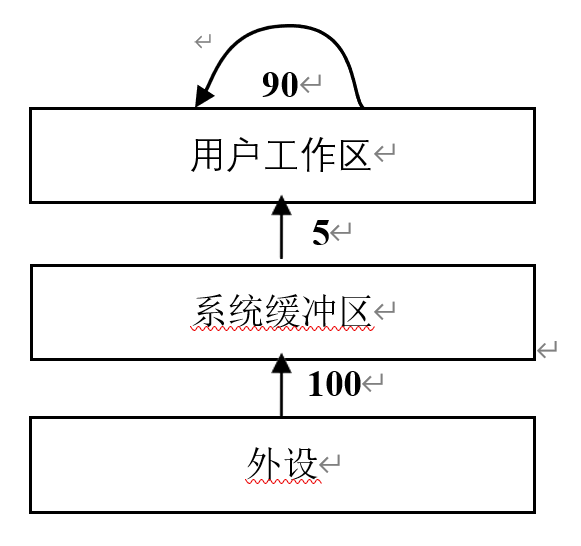
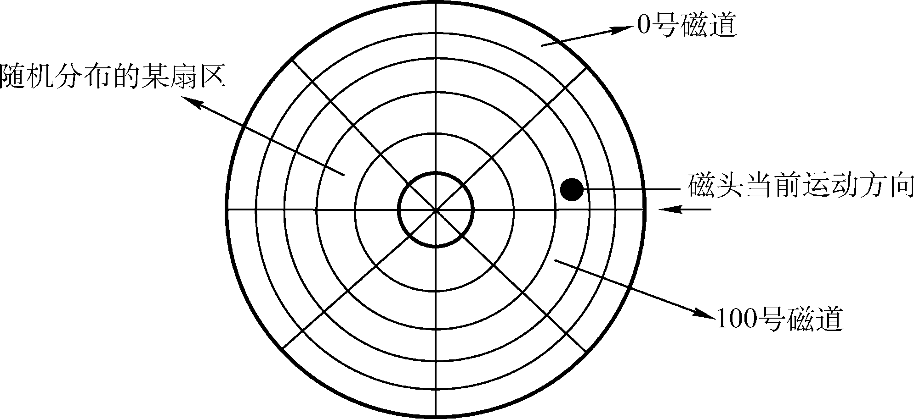

# 按照本书-第7章-设备管理

## 一、选择题

1. (2012) 操作系统的 I/O 子系统通常由四个层次组成，每一层明确定义了与邻近层次的接口。其合理的层次组织排列顺序是（    ）。

A. 用户级 I/O 软件、设备无关软件、设备驱动程序、中断处理程序
B. 用户级 I/O 软件、设备无关软件、中断处理程序、设备驱动程序
C. 用户级 I/O 软件、设备驱动程序、设备无关软件、中断处理程序
D. 用户级 I/O 软件、中断处理程序、设备无关软件、设备驱动程序

2. (2009) 程序员利用系统调用打开 I/O 设备时，通常使用的设备标识是（    ）。

A. 逻辑设备名
B. 物理设备名
C. 主设备号
D. 从设备号

3. (2020) 对于具备设备独立性的系统，下列叙述中，错误的是（    ）。

A. 可以使用文件名访问物理设备
B. 用户程序使用逻辑设备名访问物理设备
C. 需要建立逻辑设备与物理设备之间的映射关系
D. 更换物理设备后必须修改访问该设备的应用程序

4. (2023) 下列因素中，设备分配需要考虑的是（    ）。

Ⅰ. 设备的类型
Ⅱ. 设备的访问权限
Ⅲ. 设备的占用状态
Ⅳ. 逻辑设备与物理设备的映射关系

A. 仅Ⅰ、Ⅱ
B. 仅Ⅰ、Ⅲ
C. 仅Ⅲ、Ⅳ
D. Ⅰ、Ⅱ、Ⅲ、Ⅳ

5. (2011) 用户程序发出磁盘 I/O 请求后，系统的正确处理流程是（    ）。

A. 用户程序→系统调用处理程序→中断处理程序→设备驱动程序
B. 用户程序→系统调用处理程序→设备驱动程序→中断处理程序
C. 用户程序→设备驱动程序→系统调用处理程序→中断处理程序
D. 用户程序→设备驱动程序→中断处理程序→系统调用处理程序

6. (2012) 下列选项中，不能改善磁盘设备 I/O 性能的是（    ）。

A. 重排 I/O 请求次序
B. 在一个磁盘上设置多个分区
C. 预读和滞后写
D. 优化文件物理块的分布

7. (2013) 用户程序发出磁盘 I/O 请求后，系统的处理流程是：用户程序→系统调用处理程序→设备驱动程序→中断处理程序。其中，计算数据所在磁盘的柱面号、磁头号、扇区号的程序是（    ）。

A. 用户程序
B. 系统调用处理程序
C. 设备驱动程序
D. 中断处理程序

8. (2022) 下列关于驱动程序的叙述中，不正确的是（    ）。

A. 驱动程序与 I/O 控制方式无关
B. 初始化设备是由驱动程序控制完成的
C. 进程在执行驱动程序时可能进入阻塞态
D. 读/写设备的操作是由驱动程序控制完成的

9. (2011) 某文件占 10 个磁盘块，现要把该文件磁盘块逐个读入主存缓冲区，并送用户区进行分析，假设一个缓冲区与一个磁盘块大小相同，把一个磁盘块读入缓冲区的时间为 100ms，将缓冲区的数据传送到用户区的时间是 50ms，CPU 对一块数据进行分析的时间为 50ms。在单缓冲区和双缓冲区结构下，读入并分析完该文件的时间分别是（    ）。

A. 1500ms、1000ms
B. 1550ms、1100ms
C. 1550ms、1550ms
D. 2000ms、2000ms

10. (2013) 设系统缓冲区和用户工作区均采用单缓冲，从外设读入 1 个数据块到系统缓冲区的时间为 100，从系统缓冲区读入 1 个数据块到用户工作区的时间为 5，对用户工作区中的 1 个数据块进行分析的时间为 90（如下图所示）。进程从外设读入并分析 2 个数据块的最短时间是（    ）。

A. 200
B. 295
C. 300
D. 390

11. (2015) 在系统内存中设置磁盘缓冲区的主要目的是（    ）。

A. 减少磁盘 I/O 次数
B. 减少平均寻道时间
C. 提高磁盘数据可靠性
D. 实现设备无关性

12. (2017) 系统将数据从磁盘读到内存的过程包括以下操作：

① DMA 控制器发出中断请求
② 初始化 DMA 控制器并启动磁盘
③ 从磁盘传输一块数据到内存缓冲区
④ 执行“DMA 结束”中断服务程序

正确的执行顺序是（    ）。

A. ③→①→②→④
B. ②→③→①→④
C. ②→①→③→④
D. ①→②→④→③

13. (2016) 下列关于 SPOOLing 技术的叙述中，错误的是（    ）。

A. 需要外存的支持
B. 需要多道程序设计技术的支持
C. 可以让多个作业共享一台独占设备
D. 由用户作业控制设备与输入/输出井之间的数据传送

14. (2010) 本地用户通过键盘登录系统时，首先获得键盘输入信息的程序是（    ）。

A. 命令解释程序
B. 中断处理程序
C. 系统调用服务程序
D. 用户登录程序

15. (2009) 假设磁头当前位于第 105 道，正在向磁道序号增加的方向移动。现有一个磁道访问请求序列为35，45，12，68，110，180，170，195，采用 SCAN 调度（电梯调度）算法得到的磁道访问序列是（    ）。

A. 110，170，180，195，68，45，35，12
B. 110，68，45，35，12，170，180，195
C. 110，170，180，195，12，35，45，68
D. 12，35，45，68，110，170，180，195

16. (2015) 某硬盘有 200 个磁道（最外侧磁道号为 0），磁道访问请求序列为：130，42，180，15，199，当前磁头位于第 58 号磁道并从外侧向内侧移动。按照 SCAN 调度方法处理完上述请求后，磁头移过的磁道数是（    ）。

A. 208
B. 287
C. 325
D. 382

17. (2018) 系统总是访问磁盘的某个磁道而不响应对其他磁道的访问请求，这种现象称为磁臂黏着。下列磁盘调度算法中，不会导致磁臂黏着的是（    ）。

A. 先来先服务（FCFS）
B. 最短寻道时间优先（SSTF）
C. 扫描算法（SCAN）
D. 循环扫描算法（CSCAN）

18. (2021) 某系统中磁盘的磁道数为 200（0～199），磁头当前在 184 号磁道上。用户进程提出的磁盘访问请求对应的磁道号依次为 184、187、176、182、199。若采用最短寻道时间优先调度算法（SSTF）完成磁盘访问，则磁头移动的距离（磁道数）是（    ）。

A. 37
B. 38
C. 41
D. 42

## 二、综合题

1. (2023) 进程 P 通过执行系统调用从键盘接收一个字符的输入。已知此过程中与进程 P 相关的操作包括：①将进程 P 插入就绪队列；②将进程 P 插入阻塞队列；③将字符从键盘控制器读入系统缓冲区；④启动键盘中断处理程序；⑤进程 P 的系统调用返回；⑥用户在键盘上输入字符。以上编号 ①～⑥ 仅用于标记操作，与操作的先后顺序无关。请回答下列问题：

（1）按照正确的操作顺序，操作 ① 的前一个和后一个操作分别是上述操作中的哪一个？操作 ⑥ 的后一个操作是上述操作中的哪一个？

（2）在上述哪个操作之后，CPU 一定从进程 P 切换到其他进程？在上述哪个操作之后，CPU 调度程序才能选中进程 P 执行？

（3）完成上述哪个操作的代码属于键盘驱动程序？

（4）键盘中断处理程序执行时，进程 P 处于什么状态？CPU 处于内核态还是用户态？

2. (2010) 假设计算机系统采用 CSCAN（循环扫描）磁盘调度策略，使用 2KB 的内存空间记录 16 384 个磁盘块的空闲状态。

（1）请说明在上述条件下如何进行磁盘块空闲状态的管理。

（2）设某单面磁盘旋转速度为 6000r/min，每个磁道有 100 个扇区，相邻磁道间的平均移动时间为 1ms。若在某时刻，磁头位于 100 号磁道处，并沿着磁道号增大的方向移动（如图 B-5 所示），磁道号请求队列为 50，90，30，120，对请求队列中的每个磁道需读取 1 个随机分布的扇区，则读完这 4 个扇区点共需要多少时间？要求给出计算过程。

（3）如果将磁盘替换为随机访问的 Flash 半导体存储器（如 U 盘、SSD 等），是否有比 CSCAN 更高效的磁盘调度策略？若有，给出磁盘调度策略的名称并说明理由；若无，说明理由。

3. (2019) 某计算机系统中的磁盘有 300 个柱面，每个柱面有 10 个磁道，每个磁道有 200 个扇区，扇区大小为 512B。文件系统的每个簇包含 2 个扇区。请回答下列问题：

（1）磁盘的容量是多少？

（2）假设磁头在 85 号柱面上，此时有 4 个磁盘访问请求，簇号分别为 100260、60005、101660 和 110560。若采用最短寻道时间优先（SSTF）调度算法，则系统访问簇的先后次序是什么？

（3）第 100530 簇在磁盘上的物理地址是什么？将簇号转换成磁盘物理地址的过程是由 I/O 系统的什么程序完成的？
